# Architecture

Clean Reactive Architecture is an implementation of the [Clean Architecture
concept](https://blog.cleancoder.com/uncle-bob/2012/08/13/the-clean-architecture.html).
For everything not specified below engineers and developers should rely on the
concept.

Clean Reactive Architecture is outlined with the following UML diagram:


### Definition of units

- **Entities**: A unit that maintains one or more enterprise business
  entities, application business entities, or a mix of both.
- **Use Case Interactor**: A unit that orchestrates the flow of data to the
  entities, and directs those entities to use their business rules to achieve
  the goals of the use case.
- **Gateway**: A unit that encapsulates access to an external system or
  resource.
- **Controller**: A unit that handles input data from the user interface and
  converts it into a format most convenient for the use cases and
  entities.
- **Presenter**: A unit that converts data from entities into a format most
  convenient for the user interface.
- **User Interface**: A unit that displays information to the user based on the
  data prepared by the presenter, and captures user input and transfers it to
  the controller.
- **External system or resource**: A unit that represents external systems or
  resources the application interacts with, e.g., services, databases, storage,
  or other applications and libraries with an API.

### Definition of concepts utilized by the units

- **Enterprise Business Entity**: An entity that encapsulates enterprise
  business rules and data.
- **Enterprise Business Rules and Data**: Rules and data that would exist even
  if the application didn't exist. These enterprise-wide rules are independent of
  any specific application.
- **Application Business Entity**: An entity that encapsulates
  application-specific business rules and data.
- **Application Business Rules and Data**: Rules and data specific to the
  application's functionality. These are application-wide rules that don't
  exist outside the context of a particular application.
- **State**: The data of entities at a given point in time, typically
  represented as an object structure.
- **Valid State**: One of a finite number of states considered valid according
  to the enterprise and application business rules.

The *double lines* on the diagram represent boundaries, which data crosses as
primitive data types or data structures, for example DTOs or plain objects.

See also: 

Robert C. Martin. [The Clean
Architecture](https://blog.cleancoder.com/uncle-bob/2012/08/13/the-clean-architecture.html)

Robert C. Martin. (2017). [Clean Architecture: A Craftsman's Guide to
Software Structure and
Design](https://www.amazon.nl/Clean-Architecture-Craftsmans-Software-Structure/dp/0134494164/)

## Q&A

<details>
  <summary><b>Where did the diagram come from?</b></summary>

Clean Architecture is a formalized architectural concept for application
software. The most overlooked factor here is that the implementation of Clean
Architecture is a UML diagram. The concept itself is too abstract, while the
codebase is too concrete. And a UML diagram bridges that.


For a typical backend application written in Java, a well-known Clean
Architecture implementation has existed for years.


*Clean Architecture. A craftsman’s guide to software structure and design.
Robert C. Martin. Copyright © 2018 Pearson Education, Inc.*

However, this implementation does not directly apply to reactive applications.
Attempts to use it introduce code solely for adapting it. Nevertheless, the
Clean Architecture concept is universal and an implementation tailored for a
reactive application, for example with external API integration, is
constructed as follows:


> NOTE: The diagram shows units (conceptual responsibilities), not files or
> folder structure. Units are how the system should be thought about at
> runtime - which unit owns what, dependencies, where responsibilities lie.
> How units are organized into files is a separate organizational decision,
> independent of the architecture. 

</details>

<details>
  <summary><b>Where does the application business entity come from?</b></summary>

Clean Architecture distinguishes between *enterprise business rules and data*
and *application business rules*. Enterprise rules and data are independent of
any particular application and live inside *entities*.  Application rules are
specific to a particular application's behavior and live inside *use cases*
and apply as orchestration logic during the use case call.

However, reactive client applications introduce a category of
**application-specific concern** that requires an extension of this model:
**persistent, observable state with its own validity rules and lifetime,
independent of any single use case invocation**.

Consider the runtime state of an asynchronous refresh: `idle`, `loading`,
`error` with a message. This state has its own valid configuration
(transitions are not random - it cannot move directly from `error` to
`loading`, it requires an explicit retry, an `idle` state cannot have an error
message). The state has its own observable lifetime - different parts of the
user interface may react to it independently. It makes sense only within
applications that perform asynchronous synchronization. And it persists across
many operations longer than any use case call.

This is application-specific, but it is not orchestration logic. It is state
(data) with rules, which can be recognized as an **application business
entity**.  Clean Reactive Architecture puts it where it belongs - the
*entities* layer, and gives presenters that read it and use cases that
transition it.

Reactive client applications deal with this type of state constantly, though
it rarely receives architectural recognition. Examples:

- *Operation state* — `idle` / `loading` / `error`, per operation.
- *Initialization state* — `uninitialized` / `initializing` / `ready`.
- *Session state* — `authenticated` / `refreshing` / `expired`.
- *Route state* — current route, parameters, back stack.
- *Form state* — field values, dirty flags, validation status, submission
  lifecycle.
- *Connectivity state* — `online` / `offline` / `metered`.
- *Selection state* — multi-select sets, expansion flags, focus.

Each of these has its own validity rules and observable transitions. Each is
application-specific.

</details>

<details>
  <summary><b>Does it support unidirectional flow?</b></summary>

Clean Reactive Architecture supports unidirectional flow out of the box, and
holds it more strictly than in architectures with stateful hubs. The flow
never crosses and reverses.

Unidirectional flow of control and data is the following:


The `controller` receives user input, the `presenter` reacts and projects
`entities` for the `user interface`. They both are never connected to each
other - they share only the `entities`, where one path writes and the other
reads. There is no single unit (hub) which sits on both paths. 

</details>

<details>
  <summary><b>Are the SOLID principles followed?</b></summary>

Clean Reactive Architecture follows the SOLID principles.

1. *The single-responsibility principle (SRP)*. Each unit of the
   architecture has its own and only one well-defined responsibility.

2. *The open–closed principle (OCP)*. The principle is preserved by explicitly
   declared `presenter<I>`, `controller<I>` and `gateway<I>` interfaces. For
   example, the `user interface` unit is considered closed once its
   `presenter<I>` and `controller<I>` interfaces are declared - rest
   implementation depends on the declared interfaces, not the `user interface`
   unit implementation. At the same time it remains open for extension
   (composition): it can be rendered with other `user interface` units by
   utilizing mocks through the LSP.

3. *Liskov substitution principle (LSP)*. The principle is preserved by
   explicitly declared `presenter<I>`, `controller<I>` and `gateway<I>`
   interfaces. For example, through the `gateway<I>` interface, different gateway
   implementations can be provided, which may represent a remote or a local
   resource.

4. *Interface segregation principle (ISP)*. The principle is preserved by
   explicitly declared `presenter<I>`, `controller<I>` and `gateway<I>`
   interfaces. A thick interface can signal the need to split a unit into parts,
   and the interfaces can also be used to understand and define those parts.
   For example, a thick `presenter<I>` can signal that the `user interface`
   unit should be split, and the segments of that interface suggest where the
   split may happen.

5. *Dependency inversion principle (DIP)*. The principle is preserved by
   explicitly declared `gateway<I>` interfaces. Units from inner layers do not
   depend on concrete implementations of units from outer layers, instead they
   depend on abstractions. For example, the `use case` unit (inner layer) depends
   on the `gateway` unit (outer layer) through the `gateway<I>` interface.

</details>

<details>
  <summary><b>How does it scale?</b></summary>

As the codebase grows, it will obviously need more units to share common
logic. Following the Clean Architecture concept, the UML diagram can be
extended with additional units, which will fit an additional circle (layer) in
the circular diagram of the concept. Such extension is consistent.

The extended diagram is the following:


The diagram represents units which are empirically sufficient for a quite
large codebase.

### Definition of additional units

- **Selector**: Unit that derives values or aggregates data structures from
  the entities without modifying them.
- **Transaction**: Unit that transitions entities between two valid states,
  ensuring business rules are maintained.
- **Effect**: Unit that manages data flows to, from, and across gateways
  (sequential, parallel, etc.) and derives data structures from them.

</details>

<details>
  <summary><b>How does it share business logic?</b></summary>

Enterprise business rules and data are explicit in Clean Reactive
Architecture, so they can be extracted into a separate core (library) to be
shared across multiple reactive and non-reactive clients.

Such a core (library) will know nothing about any client. It will have its own
API and, for example, its own mechanism for storing data. The most practial
thing here is that the core (library) can be built following the same Clean
Architecture concept but outlined with the classical, non-reactive UML diagram
\- so one concept covers two different types of applications.

High level architecture:

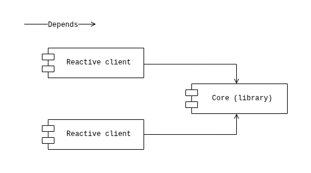

Architecture of the reactive client: 

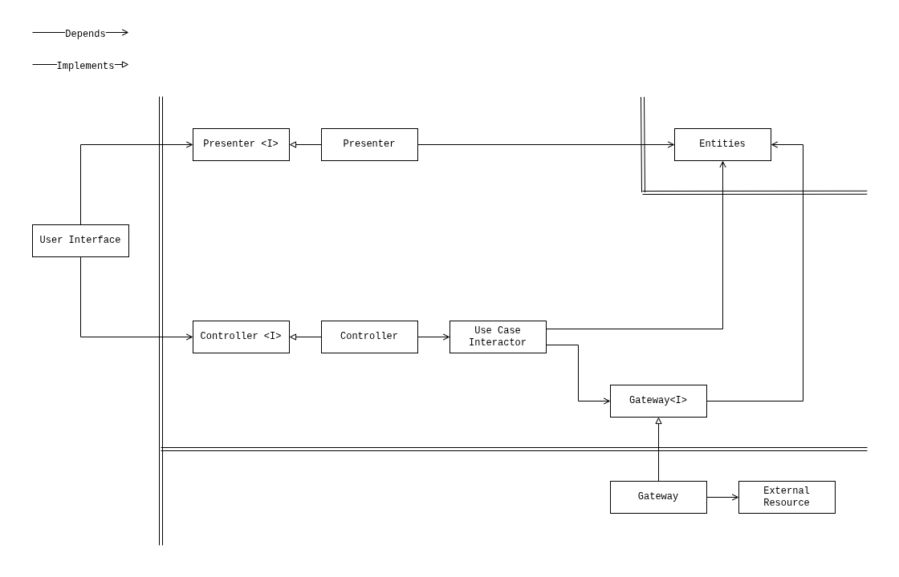

Architecture of the core (library):

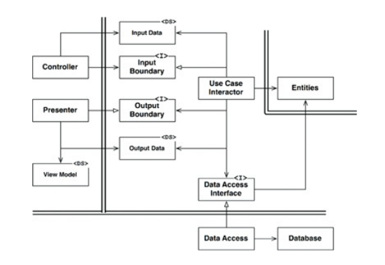

In fact, the core (library) implementation can follow any other architectural
concept — hexagonal, DDD, or none at all. It can even be developed in parallel
with a reactive client - the client's gateway will connect the two parts
later.

</details>

<details>
  <summary><b>Does it have a ViewModel?</b></summary>

Clean Reactive Architecture has a ViewModel, though it is not outlined in the
diagram for reasons of simplicity. Here "ViewModel" means what it originally
meant - the data structure the `presenter` returns and the `user interface`
consumes.

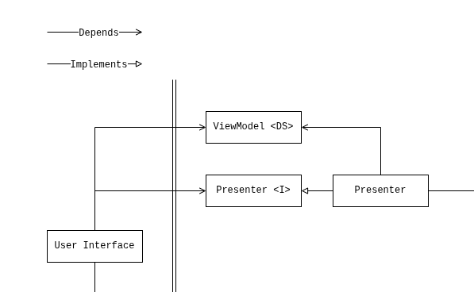

The ViewModel is just a value: comparable, snapshotable, safe to pass around,
trivial to construct for a preview or a test. It has no behavior, no
lifecycle, no identity.

It is important to note that every property of a presenter returns its own
ViewModel. Let's look at an example:

```ts
interface BooksByAuthor {
   authorName: string;
   bookTitle: string;
}

interface UserBooksPresenter {
   userName: string;
   books: BooksByAuthor[];
}
```

Here `userName` and `books` are properties of the `UserBooksPresenter`
interface, each property return own ViewModel - `userName` a primitive value,
`books` a structured one. 

</details>

<details>
  <summary><b>Does it have a repository?</b></summary>

Clean Reactive Architecture has a repository, but the diagram does not have
a separate unit for it. The repository is a composite of the `gateway` and
`entities` units that appears in code - a single implementation that satisfies
`gateway<I>` and holds the entities it serves.

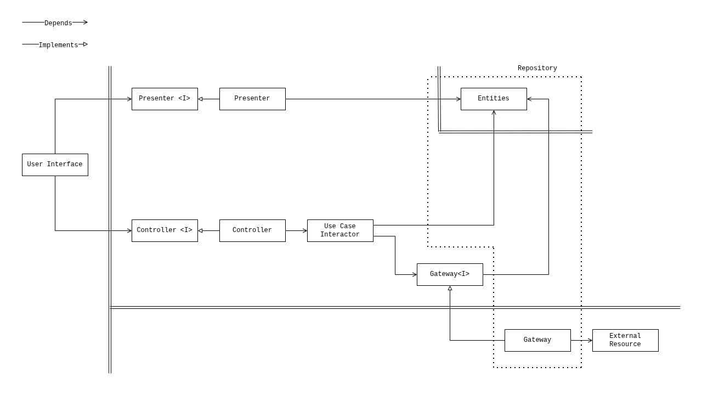

Some implementations let the repository absorb the `gateway<I>` interface -
which is acceptable, except the case where the repository defines the contract
rather than consume it. This is not desired, and the development methodology
prevents it.

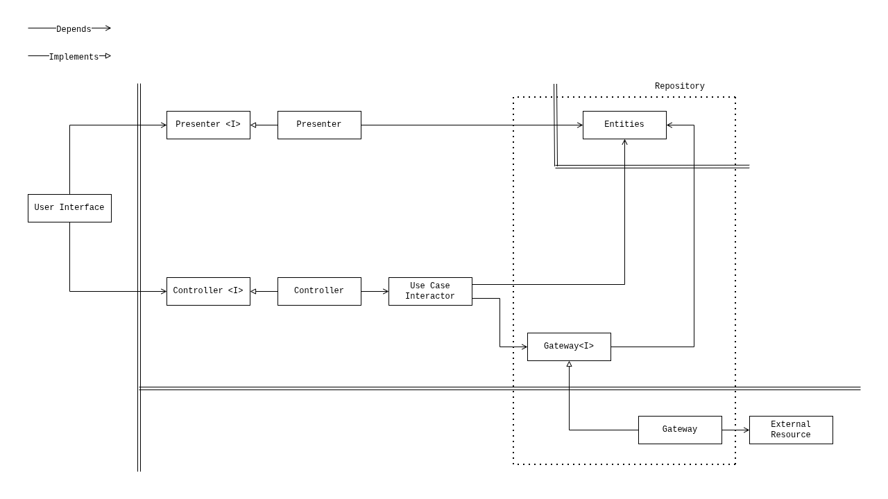


</details>

<details>
  <summary><b>Where does an alternative driver fit?</b></summary>

The `user interface` is not a privileged unit, it is a detail. Clean Reactive
Architecture treats the `user interface` as one driver among several.  

A **driver** exercises the core: it provides input through controllers and
observes the core's changes through presenters. Normally each driver has its
_own controller and presenter implementations_, which are specific to a
particular driver. What is shared is the core: `use case`, `entities` and
`gateway<I>` that every driver's controllers and presenters meet. 

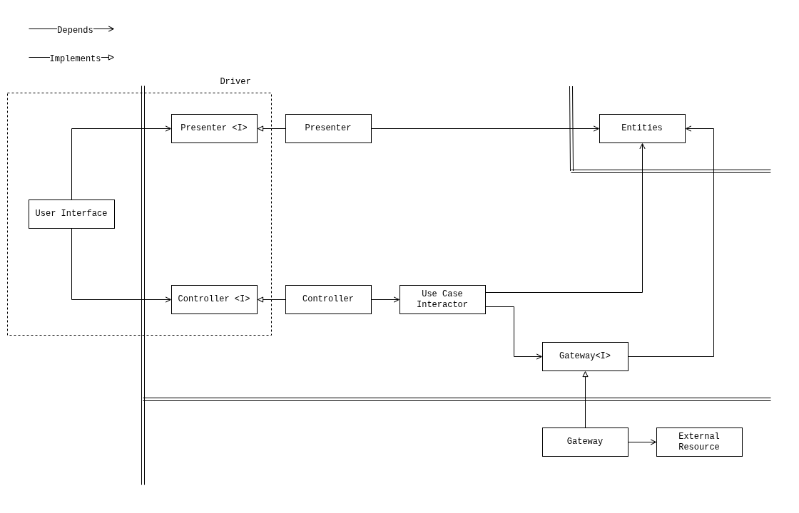

Common drivers:

- a *test harness* drives the core through controllers and observes state to
  assert against it;
- a *notification or deep link* drives the core when an external event
  arrives;

Let's consider a WebSocket. Incoming messages drive the core: a listener
receives them and feeds them in through a controller, exactly as a user
gesture would. Outgoing commands take the other path: they leave the core
through a gateway, since the socket is also an external resource. The same
connection is therefore _both_ a driver (inbound) and an external resource
(outbound), sitting on both sides of the core - the core does not know (and
does not care) that the input arriving through its controller and the output
leaving through its gateway belong to the same socket.

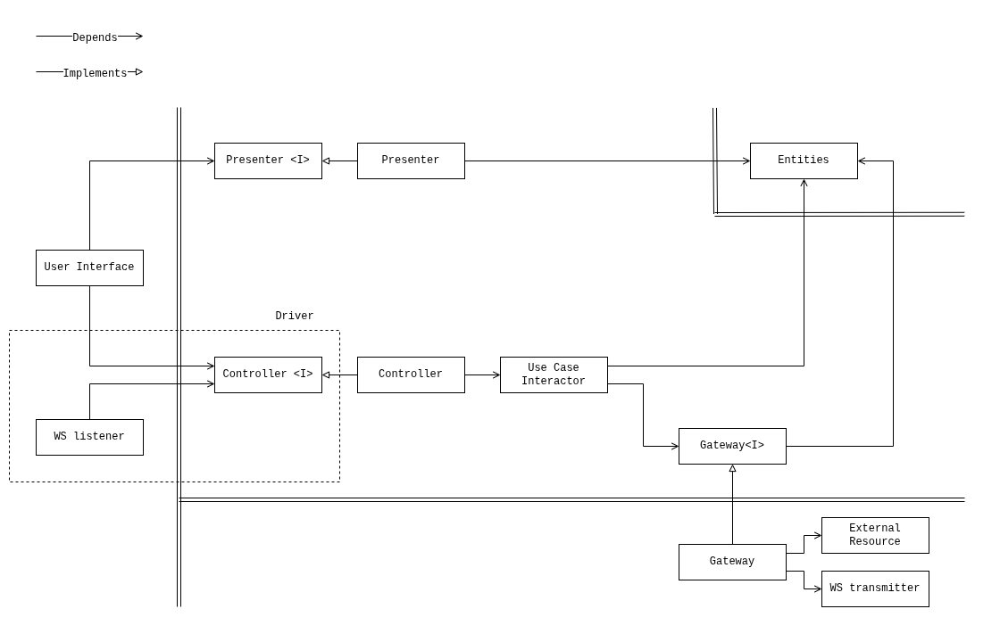

</details>

<details>
  <summary><b>Where does a Backend for Frontend fit?</b></summary>

A gateway adapts a general-purpose external API into the shape a client
actually needs - mapping responses, combining several calls, reshaping data to
match the entities the application works with. The more a general-purpose API
differs from what the client needs, the more adaptation accumulates in the
gateways.

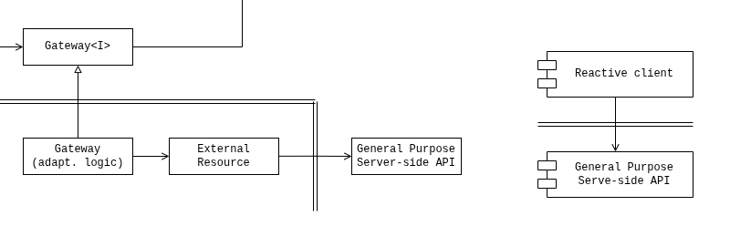

That accumulated adaptation is the signal for a Backend for Frontend (BFF). A
BFF is a server-side layer built for one specific client, it performs the
mapping and aggregation the client would otherwise do itself. In these terms,
the BFF is the difference between the gateway and the general-purpose API -
the adaptation moved to the server, where it can be done once and closer to
the data.

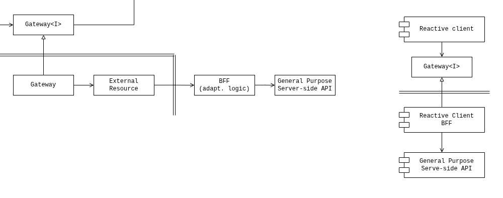

The architecture makes this visible. Because adaptation is localized in
gateways rather than distributed across the codebase, heavy mappers and
aggregations in the gateways are a concrete indication that the work belongs
server-side. When a BFF takes over that adaptation, the client's gateways
become thin - the BFF returns data already shaped for the client.  As the
client's needs evolve, the gateways begin accumulating adaptations again,
signalling the next round of BFF update.

See also: 

S. Newman. [Pattern: Backends For Frontends](https://samnewman.io/patterns/architectural/bff/)

</details>

<details>
  <summary><b>How does it map to the testing pyramid?</b></summary>

Clear Reactive Architecture maps cleanly onto the testing pyramid. 

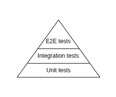

Each level corresponds to a level of unit composition:

- *Unit tests* test individual architectural units in isolation - a presenter,
  a use case, a gateway implementation.
- *Integration tests* test architectural units working together - a controller
  through its use case to a gateway, or a gateway integration with an external
  resource.
- *End-to-end tests* test the full path through the architectural units, from
  the `user interface` unit to the `external resource` unit.

Because the units and their boundaries are explicit, each test level has a
clear target: the pyramid's layers are the architecture's layers of
composition.

</details>
