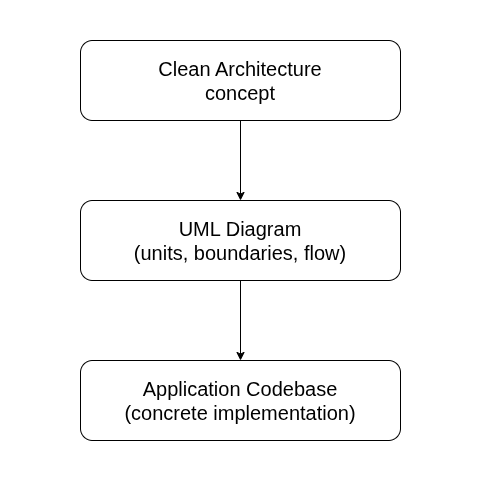
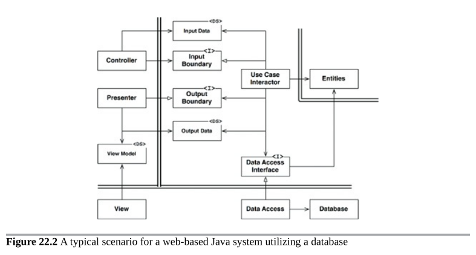
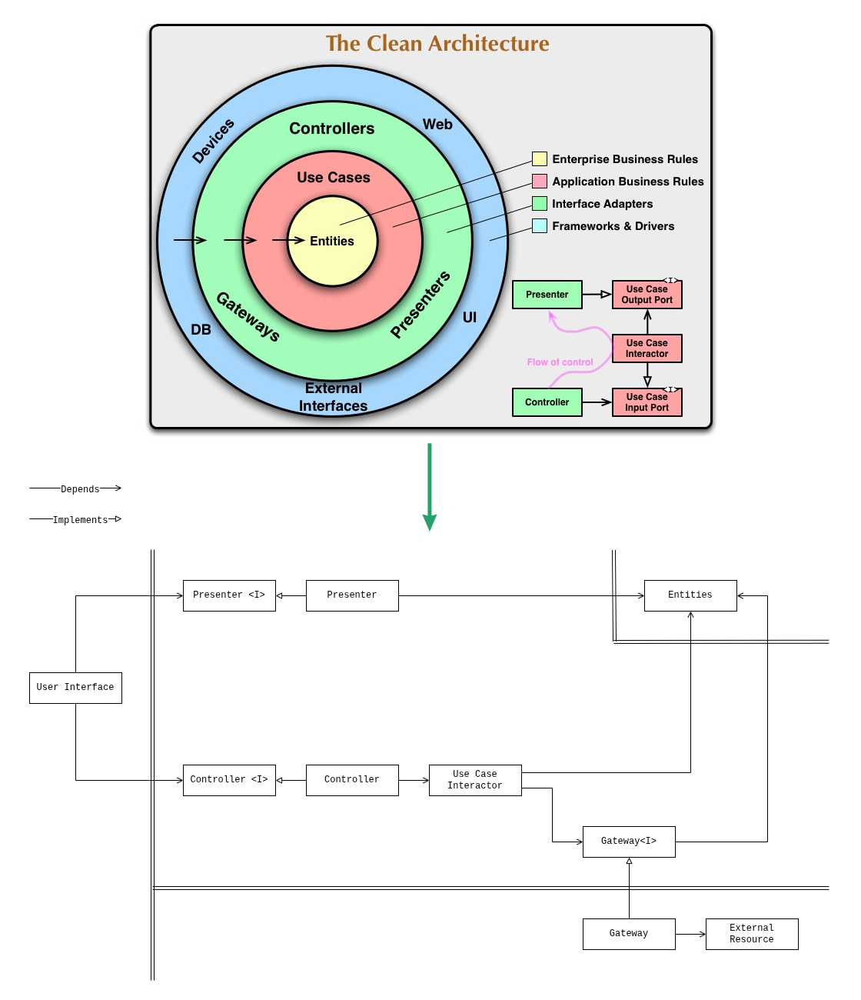

# Architecture

The *Clean Reactive Architecture* is based on the 
[Clean Architecture](https://blog.cleancoder.com/uncle-bob/2012/08/13/the-clean-architecture.html)
concept. The following UML diagram outlines it:

### Definition of units

- **Entities**: A unit that maintains one or more enterprise business
  entities, application business entities, or a mix of both.
- **Use Case Interactor**: A unit that orchestrates the flow of data to the
  entities, and directs those entities to use their business rules to achieve
  the goals of the use case.
- **Gateway**: A unit that encapsulates access to an external system or
  resource.
- **Controller**: A unit that handles input data from the user interface and
  converts it into a format most convenient for the use cases and
  entities.
- **Presenter**: A unit that converts data from entities into a format most
  convenient for the user interface.
- **User Interface**: A unit that displays information to the user based on the
  data prepared by the presenter, and captures user input and transfers it to
  the controller.
- **External system or resource**: A unit that represents external systems or
  resources the application interacts with, e.g., services, databases, storage,
  or other applications and libraries with an API.

### Definition of concepts utilized by the units

- **Enterprise Business Entity**: An entity that encapsulates enterprise
  business rules and data.
- **Enterprise Business Rules and Data**: Rules and data that would exist even
  if the application didn't exist. These enterprise-wide rules are independent of
  any specific application.
- **Application Business Entity**: An entity that encapsulates
  application-specific business rules and data.
- **Application Business Rules and Data**: Rules and data specific to the
  application's functionality. These are application-wide rules that don't
  exist outside the context of a particular application.
- **State**: The data of entities at a given point in time, typically
  represented as an object structure.
- **Valid State**: One of a finite number of states considered valid according
  to the enterprise and application business rules.

The *double lines* on the diagram represent boundaries, which data crosses as
primitive data types or data structures, for example DTOs or plain objects.

  
<b>Where did the diagram come from?</b>

The Clean Architecture is a formalized architectural concept for application
software. The most overlooked factor here is that the implementation of the
Clean Architecture is a UML diagram. The concept itself is too abstract,
while the codebase is too concrete. And a UML diagram bridges that.

For a typical backend application written in Java, a well-known Clean
Architecture implementation has existed for years.

*Clean Architecture. A craftsman’s guide to software structure and design.
Robert C. Martin. Copyright © 2018 Pearson Education, Inc.*

However, this implementation does not directly apply to reactive applications.
Attempts to use it introduce code solely for adapting it. Nevertheless, the
Clean Architecture concept is universal and an implementation tailored for a
reactive application, for example with external API integration, is
constructed as follows:

  
<b>Where does the application business entity come from?</b>

Classical Clean Architecture distinguishes between *enterprise business rules
and data* and *application business rules*. Enterprise rules and data are
independent of any particular application and live inside *entities*.
Application rules are specific to a particular application's behavior and live
inside *use cases* and apply as orchestration logic during the use case call.

However, reactive client applications introduce a category of
**application-specific concern** that requires an extension of this model:
**persistent, observable state with its own validity rules and lifetime,
independent of any single use case invocation**.

Consider the runtime state of an asynchronous refresh: `idle`, `loading`,
`error` with a message. This state has its own valid configuration
(transitions are not random - it cannot move directly from `error` to
`loading`, it requires an explicit retry; an `idle` state cannot have an error
message). The state has its own observable lifetime - different parts of the
user interface may react to it independently. It makes sense only within
applications that perform asynchronous synchronization. And it persists across
many operations longer than any use case call.

This is application-specific, but it is not orchestration logic. It is state
(data) with rules, which can be recognized as an **application business
entity**.  Clean Reactive Architecture puts it where it belongs - the
*entities* layer, and gives presenters that read it and use cases that
transition it.

Reactive client applications deal with this type of state constantly, though
it rarely receives architectural recognition. Examples:

- *Operation state* — `idle` / `loading` / `error`, per operation.
- *Session state* — `authenticated` / `refreshing` / `expired`.
- *Route state* — current route, parameters, back stack.
- *Form state* — field values, dirty flags, validation status, submission
  lifecycle.
- *Connectivity state* — `online` / `offline` / `metered`.
- *Selection state* — multi-select sets, expansion flags, focus.

Each of these has its own validity rules and observable transitions. Each is
application-specific.

  
<b>Does it support unidirectional flow?</b>

Clean Reactive Architecture supports unidirectional flow out of the box, and
holds it more strictly than in architectures with stateful hubs. 

Unidirectional flow of control and data is the following:

The controller receives user input, the presenter reacts and projects entities
for the user interface. They both are never connected to each other - they
share only the entities, where one path writes and the other reads. There is
no single unit (hub) which sits on both paths. The flow never crosses and
reverses.

  
<b>Are the SOLID principles followed?</b>

Clean Reactive Architecture follows the SOLID principles. The SOLID principles
are practical here.

1. *The single-responsibility principle (SRP)*. Each unit of the
   architecture has its own and only one well-defined responsibility.

2. *The open–closed principle (OCP)*. The principle is preserved by explicitly
   declared `presenter<I>`, `controller<I>` and `gateway<I>` interfaces. For
   example, the `user interface` unit is considered closed once its
   `presenter<I>` and `controller<I>` interfaces are declared - rest
   implementation depends on the declared interfaces, not the `user interface`
   unit implementation. At the same time it remains open for extension
   (composition): it can be rendered with other `user interface` units by
   utilizing mocks through the LSP.

3. *Liskov substitution principle (LSP)*. The principle is preserved by
   explicitly declared `presenter<I>`, `controller<I>` and `gateway<I>`
   interfaces. For example, through the `gateway<I>` interface, different gateway
   implementations can be provided, which may represent a remote or a local
   resource.

4. *Interface segregation principle (ISP)*. The principle is preserved by
   explicitly declared `presenter<I>`, `controller<I>` and `gateway<I>`
   interfaces. A thick interface can signal the need to split a unit into parts,
   and the interfaces can also be used to understand and define those parts.
   For example, a thick `presenter<I>` can signal that the `user interface`
   unit should be split, and the segments of that interface suggest where the
   split may happen.

5. *Dependency inversion principle (DIP)*. The principle is preserved by
   explicitly declared `gateway<I>` interfaces. Units from inner layers do not
   depend on concrete implementations of units from outer layers, instead they
   depend on abstractions. For example, the `use case` unit (inner layer) depends
   on the `gateway` unit (outer layer) through the `gateway<I>` interface.

  
<b>How does it scale?</b>

  
<b>How to share business logic?</b>

  
<b>What happened to the ViewModel?</b>

  
<b>Where does the repository fit?</b>

  
<b>How does it map to the testing pyramid?</b>

