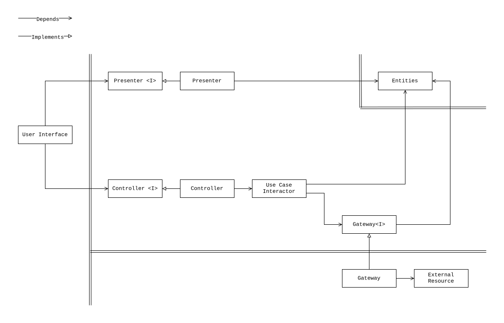
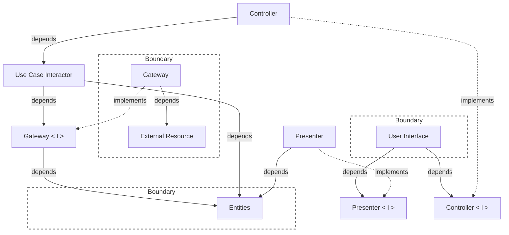

# Introduction

This guide is the gentle way in. It explains what Clean Reactive Architecture
is for, names its units in plain words, and walks through the smallest sample,
[a counter](https://github.com/clean-reactive/sample-react-one-file), unit by
unit. The guide then changes the counter twice - extracting a gateway from
repeated code and adding an entity for a new requirement - to show how a
feature evolves without being rewritten.

You only need to have built a component in a reactive framework before - React,
Angular, Vue, Flutter, SwiftUI or similar. The examples use React, but nothing
in the architecture depends on it.

## The problem

A component in a reactive application usually does many things at once. It
fetches data, holds state, applies rules, formats values for display, handles
clicks and renders the result. While the feature is small, this is fine. As it
grows, the responsibilities start to interfere: a formatting change breaks a
rule, a rule is duplicated in three event handlers, a renamed field in the API
response breaks the rendering code, and when a value on the screen is wrong,
it is difficult to trace why.

Splitting the component should help, but nothing says where one responsibility
ends and the next begins. Every change starts with the same question - which of
these lines belong together? - and every developer answers it differently.

Clean Reactive Architecture answers that question once. It gives each of these
responsibilities a name - a *unit* - and defines which unit may depend on which,
so the boundaries are the same for every developer and every framework. It does
not tell you to split files, create classes, or add a library.

## Units in plain words

Each unit owns one responsibility.

| Unit                  | Responsible for                                                  | In the counter                         |
| --------------------- | ---------------------------------------------------------------- | -------------------------------------- |
| `user interface`      | showing static and interactive things to the user                | the JSX with the value and two buttons |
| `presenter`           | deciding what to show                                            | `countStatus` - "Positive", "Zero"     |
| `controller`          | catching what the user did                                       | `onIncrementButtonClick`               |
| `use case interactor` | doing what the user asked for                                    | ask the gateway, then update `count`   |
| `entities`            | keeping what is true, and keeping it right                       | `count`                                |
| `gateway`             | translating to and from the outside world                        | the in-memory and `fetch` branches     |
| `external resource`   | representing what is outside the app - servers, storage, devices | the in-memory counter, `/api/counter`  |

Two more words the architecture introduces:

- An **interface** marked with `<I>` - a contract. `presenter<I>`, `controller<I>` and
  `gateway<I>` are declared by the unit that *uses* them, not by the unit that
  implements them. An interface does not have to be a language `interface`; a
  type of a value is enough.
- A **boundary** is a line data crosses only as primitive data types or data
  structures - for example DTOs or plain objects.

## The diagram



<details>
  <summary>mermaid</summary>



</details>

The *double lines* on the diagram are the boundaries.

The diagram has two kinds of arrows, shown in its legend. An arrow with an open
head means *depends* - read it as "knows about". An arrow with a hollow
triangle means *implements* - the unit fulfils the contract it points to.

Notice what is missing: `entities` know about nothing, the `use case` does not
know which `gateway` it talks to, and the `user interface` does not know how its
data was prepared. That is what lets each part change on its own.

## Two paths

Everything the application does travels along one of two paths.

- **Write path** - the user acts: `user interface` → `controller` →
  `use case` → (`gateway`) → `entities`.
- **Read path** - the application reacts: `entities` → `presenter` →
  `user interface`.

The paths meet only at the `entities`: one writes, the other reads. Between
the `user interface` and the `entities`, no unit sits on both paths. This keeps
display formatting separate from business decisions, so changing how a value
is shown should not require changing the rules that update it.

The `user interface` closes the loop as an observer of the `entities`. When an
entity changes, everything that observes it updates - there is no code that
"pushes" the new value to the screen.

## Reading the counter

Open [`App.tsx`](https://github.com/clean-reactive/sample-react-one-file/blob/main/src/App.tsx)
from the one-file sample. Every unit lives in one component, and each is
marked with a `#region` comment.

**Entities** - hold state and its validity rules. The counter starts with a
single number and needs no additional validity rules:

```tsx
//#region entities unit
const [count, setCount] = useState<number>(0);
//#endregion entities unit
```

The entity is built with a framework primitive, `useState`, and there is no
reason to avoid it. What matters is that the state is visible, in one explicit
place.

**Presenter** - derives and composes what the screen needs from the entities:

```tsx
//#region presenter unit
const countValue = count;
const countStatus =
  count === 0 ? "Zero" : count > 0 ? "Positive" : "Negative";
//#endregion presenter unit
```

The rule "zero, positive or negative" is a display concern, so it lives here,
not in the JSX and not in the event handler.

**Controller and use case** - turn a click into a result:

```tsx
//#region controller unit
const onIncrementButtonClick = async (): Promise<void> => {
  //#region use case unit
  //#region gateway interface
  let newCount: number;
  //#endregion gateway interface
  if (import.meta.env.DEV) {
    //#region in-memory gateway unit
    await inMemoryCounterResource.increment();
    newCount = await inMemoryCounterResource.getCount();
    //#endregion in-memory gateway unit
  } else {
    //#region remote gateway unit
    // POST /api/counter/increment, then GET /api/counter ...
    newCount = data.value;
    //#endregion remote gateway unit
  }
  //#region transaction unit
  setCount(newCount);
  //#endregion transaction unit
  //#endregion use case unit
};
```

The `controller` receives the click and delegates it to the `use case`. The
`use case` asks a `gateway` for the new value and writes it into the entity. The `gateway interface` is just the
type of `newCount` - the use case needs "a number back", and both gateways
provide it. The final `setCount` is a *transaction*: it moves the entity from
one valid state to another.

`onDecrementButtonClick` has the same shape. A third controller handler,
`onAppMount`, only reads the count: the `user interface` runs it once, from a
`useEffect` lifecycle hook, when the component mounts.

**User interface** - shows presenter values and calls controller handlers:

```tsx
<span>{countValue}</span>
<button onClick={onIncrementButtonClick}>+</button>
<p>Status: {countStatus}</p>
```

The JSX never reads `count` directly and never calls a resource.

**Composition root** - `App` itself. It is where all the units above are
created and wired together. It is a framework responsibility, not an extra unit.

> NOTE: Every unit of the diagram is present, yet there is only one function
> and one file. Units are responsibilities, not files. This is the shape a
> feature starts in.

## Growing the feature

Units are extracted when they earn it - when something repeats or a new
requirement arrives - not in advance. Here are two typical moments.

### Repetition earns a gateway

The three use cases in `App.tsx` repeat the same `if (DEV) … else …`
branching. That repetition is the signal. The contract is extracted from what
the use cases need - a number back after every call:

```tsx
type CounterGateway = {
  increment: () => Promise<number>;
  decrement: () => Promise<number>;
  getCount: () => Promise<number>;
};
```

The resources separate commands from queries: a command (`increment`,
`decrement`) changes the count, and a query (`getCount`) reads it. The contract
does not copy that shape - it follows its consumer. Bridging the two is the
`gateway`'s job: each command is followed by the query.

```tsx
const inMemoryCounterGateway: CounterGateway = {
  increment: async () => {
    await inMemoryCounterResource.increment();
    return inMemoryCounterResource.getCount();
  },
  // decrement follows the same shape as increment
  getCount: () => inMemoryCounterResource.getCount(),
};

const remoteCounterGateway: CounterGateway = {
  increment: async () => {
    // command: change the count
    const commandResponse = await fetch("/api/counter/increment", {
      method: "POST",
    });
    if (!commandResponse.ok) {
      throw new Error("Failed to increment count");
    }

    // query: read the new count
    const queryResponse = await fetch("/api/counter");
    if (!queryResponse.ok) {
      throw new Error("Failed to fetch count");
    }
    const { value } = await queryResponse.json();
    return value;
  },

  // decrement follows the same shape as increment

  getCount: async () => {
    const response = await fetch("/api/counter");
    if (!response.ok) {
      throw new Error("Failed to fetch count");
    }
    const { value } = await response.json();
    return value;
  },
};
```

The composition root picks the implementation, and each use case shrinks:

```tsx
const gateway: CounterGateway = import.meta.env.DEV
  ? inMemoryCounterGateway
  : remoteCounterGateway;

const onIncrementButtonClick = async (): Promise<void> => {
  //#region use case unit
  setCount(await gateway.increment());
  //#endregion use case unit
};
```

Nothing else changed: the entities, the presenter and the JSX are untouched.
That is the payoff of the dependency arrows.

### A new requirement earns an entity

Now the product asks for a busy indicator and an error message. The work
starts where the user sees it - the `user interface`:

```tsx
<button
  onClick={onIncrementButtonClick}
  disabled={isIncrementButtonDisabled}
>
  +
</button>
{errorMessage && <p role="alert">{errorMessage}</p>}
```

The layout names what it needs: `isIncrementButtonDisabled` and
`errorMessage`. That is the `presenter` contract, and nothing in it says where
the values come from. The `controller` contract does not change - the button
still calls `onIncrementButtonClick`.

Behind the two values is new state with its own rules: an operation is `idle`,
`loading` or failed, and an `idle` operation cannot carry an error message.
State with rules is an entity - here an *application business entity*, because
it exists only because this application talks to a remote resource.

```tsx
//#region entities unit
type CounterStatus =
  | { kind: "idle" }
  | { kind: "loading" }
  | { kind: "error"; message: string };

const [count, setCount] = useState<number>(0);
const [status, setStatus] = useState<CounterStatus>({ kind: "idle" });
//#endregion entities unit
```

The `presenter` derives the two values from it:

```tsx
//#region presenter unit
const isIncrementButtonDisabled = status.kind === "loading";
const errorMessage = status.kind === "error" ? status.message : undefined;
//#endregion presenter unit
```

And the `use case` transitions it:

```tsx
const onIncrementButtonClick = async (): Promise<void> => {
  //#region use case unit
  setStatus({ kind: "loading" });
  try {
    setCount(await gateway.increment());
    setStatus({ kind: "idle" });
  } catch {
    setStatus({ kind: "error", message: "Could not increment" });
  }
  //#endregion use case unit
};
```

The read path shows the status, the write path sets it; neither knows about
the other.

### Knowing when to stop

The counter could now be split into `useCounterPresenter`,
`useCounterController`, `counterGateway.ts` and so on. Do it when a unit is
reused, becomes hard to read inline, or needs its own tests - not for symmetry.
A partially decomposed feature is not unfinished; it is where most features
spend most of their life.

## Composition, briefly

`App` is a *component composition root*: it assembles its units, including `user
interface` unit, and wires them together. Every component does the same for
itself, and `main` is the *bootstrap composition root* that starts the
application.

```text
main.tsx             Bootstrap composition root
└── App              Component composition root (the counter)
```

In a larger application the tree simply goes deeper - each child component
is the composition root of its own units.

A unit usually lives with the composition that owns it. When state must outlive
a component - for example, shared by two screens - lift it to a composition
root higher up. See *Where is a composition root?* in the [architecture
Q&A](architecture.md#qa).

## Building your own feature

The architecture does not prescribe a development process, and a team can choose
the one that works best for it. The suggested approach is to start from the
outside and move in. The full order is:

1. `user interface` (layout)
2. `presenter<I>` and `controller<I>` - extracted from what the layout uses
3. `entities`
4. `presenter`
5. `controller`
6. `use case`
7. `gateway<I>` - extracted from what the use case uses
8. `external resource`
9. `gateway`

Use only the steps the component needs. A component may only read data from
entities and display it through a `presenter` and `user interface`. Other parts
of the application populate and update those entities. Such a component needs
no `controller`, `use case`, `gateway` or `external resource` of its own.

When an entity already has the shape the screen needs, the `presenter` can
simply pass the value through, as `countValue` does.

Start everything inline in one component, and extract as described above.

The details are in the [Development Methodology](methodology.md#outside-in-development).

## Common misreadings

- **"Every unit needs its own file."** No. The diagram shows responsibilities.
  The one-file sample has all of them in one function.
- **"Every feature needs every unit."** No. Use the units the feature needs.
- **"I must design the interfaces first."** No. An interface is extracted from
  its consumer when the flow reaches it, so it contains exactly what is used.
- **"I must model the entities (the domain) first."** Not required. Starting
  from the `user interface` works well: building it clarifies the feature,
  leaves `presenter<I>` and `controller<I>` as concrete input for modeling the
  entities, and finishes the `user interface` along the way.
- **"Entities must avoid framework code."** No. Entities can use libraries and
  framework utilities, including useful tools for reactive state. Keep their
  data and rules explicit, with clean boundaries separating them from other
  responsibilities. When moving an entity, these boundaries keep the code that
  needs adaptation easy to identify.
- **"The user interface is the center."** No. The `user interface` is one
  *driver* among several. A test harness, a WebSocket listener or a deep link
  drives the same core - through a `controller`, a `presenter`, or both.

## Where to go next

1. The [one-file React sample](https://github.com/clean-reactive/sample-react-one-file) -
   run it and match every region to the diagram.
2. The [React](https://github.com/clean-reactive/sample-react),
   [Angular](https://github.com/clean-reactive/sample-angular) and
   [Flutter](https://github.com/clean-reactive/sample-flutter) samples - the
   same architecture, partially decomposed, with a repository, selectors and
   tests.
3. The [Next.js sample](https://github.com/clean-reactive/sample-nextjs-react) -
   a reactive client together with the server it talks to.
4. [Architecture](architecture.md) - where the diagram comes from, the
   extended diagram with its additional units (selector, transaction, effect),
   and the Q&A behind the design.
5. [Development Methodology](methodology.md) - how features are built and
   evolved.
