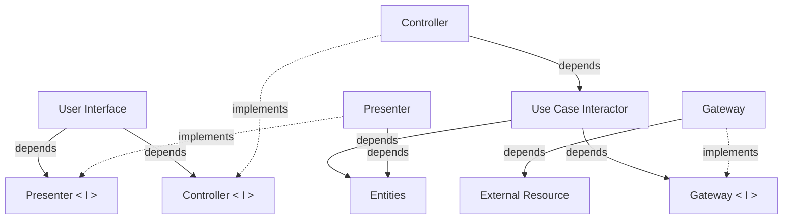

# Introduction

This guide is the gentle way in. It explains what Clean Reactive Architecture
is for, names its units in plain words, and walks through the smallest sample
- a counter - unit by unit. It then grows the counter a little, to show how a
feature evolves without being rewritten.

You only need to have built a component in a reactive framework before - React,
Angular, Vue, Flutter, SwiftUI or similar. The examples use React, but nothing
in the architecture depends on it.

## The problem

A component in a reactive application usually does many things at once. It
fetches data, holds state, applies rules, formats values for display, handles
clicks and renders the result. While the feature is small, this is fine. As it
grows, the concerns tangle: a formatting change breaks a rule, a rule is
duplicated in three event handlers, and switching the backend means touching
the rendering code.

Clean Reactive Architecture gives each of these concerns a name - a *unit* -
and defines which unit may depend on which. That is all it defines. It does not
tell you to split files, create classes, or add a library.

## Units in plain words

Each unit answers one question.

| Unit                  | The question it answers                                    | In the counter                         |
| --------------------- | ---------------------------------------------------------- | -------------------------------------- |
| `user interface`      | What does the user see, and what can the user do?          | the JSX with the value and two buttons |
| `presenter`           | What exactly should be shown?                              | `countStatus` - "Positive", "Zero"     |
| `controller`          | What did the user ask for?                                 | `onIncrementButtonClick`               |
| `use case interactor` | How is the request fulfilled?                              | call the resource, then update `count` |
| `entities`            | What is true right now, and which rules keep it valid?     | `count`                                |
| `gateway`             | How does the application talk to the outside?              | the in-memory and `fetch` branches     |
| `external resource`   | What is outside the application?                           | the in-memory counter, `/api/counter`  |

Two more words appear on the diagram:

- `<I>` marks an **interface** - a contract. `presenter<I>`, `controller<I>` and
  `gateway<I>` are declared by the unit that *uses* them, not by the unit that
  implements them. An interface does not have to be a language `interface`; a
  type of a value is enough.
- A **boundary** is a line data crosses as plain values - primitives, plain
  objects, DTOs - never as behavior.

## The diagram



Read the solid arrows as "knows about". Notice what is missing: `entities`
know about nothing, the `use case` does not know which `gateway` it talks to,
and the `user interface` does not know how its data was prepared. That is what
lets each part change on its own.

## Two paths

Everything the application does travels along one of two paths.

- **Write path** - the user acts: `user interface` → `controller` →
  `use case` → (`gateway`) → `entities`.
- **Read path** - the application reacts: `entities` → `presenter` →
  `user interface`.

The paths meet only at the `entities`: one writes, the other reads. Between
the `user interface` and the `entities`, no unit sits on both paths. In
practice this means a decision is never made from data that was formatted for
display, and a display change can never alter a decision.

The `user interface` closes the loop as an observer of the `entities`. When an
entity changes, everything that observes it re-renders - there is no code that
"pushes" the new value to the screen.

## Reading the counter

Open [`App.tsx`](https://github.com/clean-reactive/sample-react-one-file/blob/main/src/App.tsx)
from the one-file sample. Every unit lives in one component, and each is
marked with a `#region` comment.

**Entities** - the state and nothing else:

```tsx
//#region entities unit
const [count, setCount] = useState<number>(0);
//#endregion entities unit
```

The entity is built with a framework primitive, `useState`. That is allowed.
What matters is that the state has one explicit place.

**Presenter** - derives what the screen needs from the entities:

```tsx
//#region presenter unit
const countValue = count;
const countStatus =
  count === 0 ? "Zero" : count > 0 ? "Positive" : "Negative";
//#endregion presenter unit
```

The rule "zero, positive or negative" is a display concern, so it lives here,
not in the JSX and not in the event handler.

**Controller and use case** - turn a click into a result:

```tsx
//#region controller unit
const onIncrementButtonClick = async (): Promise<void> => {
  //#region use case unit
  //#region gateway interface
  let newCount: number;
  //#endregion gateway interface
  if (import.meta.env.DEV) {
    //#region in-memory gateway unit
    await inMemoryCounterResource.increment();
    newCount = await inMemoryCounterResource.getCount();
    //#endregion in-memory gateway unit
  } else {
    //#region remote gateway unit
    // fetch("/api/counter/increment") ...
    //#endregion remote gateway unit
  }
  //#region transaction unit
  setCount(newCount);
  //#endregion transaction unit
  //#endregion use case unit
};
```

The `controller` receives the click. The `use case` asks a `gateway` for the
new value and writes it into the entity. The `gateway interface` is just the
type of `newCount` - the use case needs "a number back", and both gateways
provide it. The final `setCount` is a *transaction*: it moves the entity from
one valid state to another.

**User interface** - shows presenter values and calls controller handlers:

```tsx
<span>{countValue}</span>
<button onClick={onIncrementButtonClick}>+</button>
<p>Status: {countStatus}</p>
```

The JSX never reads `count` directly and never calls a resource.

**Composition root** - `App` itself. It is where all the units above are
created and wired together. It is a responsibility, not an extra unit.

> NOTE: Every unit of the diagram is present, yet there is only one function
> and one file. Units are responsibilities, not files. This is the shape a
> feature starts in.

## Growing the feature

Units are extracted when they earn it - when something repeats or a new
requirement arrives - not in advance. Here are two typical moments.

### Repetition earns a gateway

The three use cases in `App.tsx` repeat the same `if (DEV) … else …`
branching. That repetition is the signal. The contract is extracted from what
the use cases already consume - a number back from each operation:

```tsx
type CounterGateway = {
  increment: () => Promise<number>;
  decrement: () => Promise<number>;
  getCount: () => Promise<number>;
};

const inMemoryCounterGateway: CounterGateway = {
  increment: async () => {
    await inMemoryCounterResource.increment();
    return inMemoryCounterResource.getCount();
  },
  // decrement and getCount follow the same shape
};

const remoteCounterGateway: CounterGateway = {
  increment: async () => {
    const response = await fetch("/api/counter/increment", { method: "POST" });
    if (!response.ok) throw new Error("Failed to increment count");
    return (await response.json()).value;
  },
  // decrement and getCount follow the same shape
};
```

The composition root picks the implementation, and each use case shrinks:

```tsx
const gateway = import.meta.env.DEV
  ? inMemoryCounterGateway
  : remoteCounterGateway;

const onIncrementButtonClick = async (): Promise<void> => {
  //#region use case unit
  const newCount = await gateway.increment();
  setCount(newCount);
  //#endregion use case unit
};
```

Nothing else changed: the entities, the presenter and the JSX are untouched.
That is the payoff of the dependency arrows.

### A new requirement earns an entity

Now the product asks for a busy indicator and an error message. That is new
state with its own rules: an operation is `idle`, `loading` or failed, and an
`idle` operation cannot carry an error message. State with rules is an entity
- here an *application business entity*, because it exists only because this
application talks to a remote resource.

```tsx
//#region entities unit
type CounterStatus =
  | { kind: "idle" }
  | { kind: "loading" }
  | { kind: "error"; message: string };

const [count, setCount] = useState<number>(0);
const [status, setStatus] = useState<CounterStatus>({ kind: "idle" });
//#endregion entities unit
```

The `use case` transitions it:

```tsx
const onIncrementButtonClick = async (): Promise<void> => {
  //#region use case unit
  setStatus({ kind: "loading" });
  try {
    setCount(await gateway.increment());
    setStatus({ kind: "idle" });
  } catch {
    setStatus({ kind: "error", message: "Could not increment" });
  }
  //#endregion use case unit
};
```

The `presenter` reads it:

```tsx
//#region presenter unit
const isBusy = status.kind === "loading";
const errorMessage = status.kind === "error" ? status.message : undefined;
//#endregion presenter unit
```

And the JSX only consumes `isBusy` and `errorMessage`. The write path sets the
status, the read path shows it; neither knows about the other.

### Knowing when to stop

The counter could now be split into `useCounterPresenter`,
`useCounterController`, `counterGateway.ts` and so on. Do it when a unit is
reused, becomes hard to read inline, or needs its own tests - not for symmetry.
A partially decomposed feature is not unfinished; it is where most features
spend most of their life.

## Composition, briefly

`App` is a *component composition root*: it assembles its units and wires them
to its `user interface`. Every component does the same for itself, and `main`
is the *bootstrap composition root* that starts the application.

```text
main.tsx             Bootstrap composition root
└── App              Component composition root (the counter)
```

In a larger application the tree simply goes deeper - each child component
is the composition root of its own units.

A unit usually lives with the composition that owns it. When state must outlive
a component - for example, shared by two screens - lift it to a composition
root higher up. See [Where is a composition
root?](architecture.md) in the architecture Q&A.

## Building your own feature

Start from the outside and move in. The full order is:

1. `user interface` (layout)
2. `presenter<I>` and `controller<I>` - extracted from what the layout uses
3. `entities`
4. `presenter`
5. `controller`
6. `use case`
7. `gateway<I>` - extracted from what the use case uses
8. `external resource`
9. `gateway`

Use only the steps the feature needs. A read-only feature has no `controller`
or `use case`. A single-operation feature may call the `gateway` directly. If
an entity already has the shape the screen needs, there is no `presenter`.
Start everything inline in one component, and extract as described above.

The details are in the [Development Methodology](methodology.md#outside-in-development).

## Common misreadings

- **"Every unit needs its own file."** No. The diagram shows responsibilities.
  The one-file sample has all of them in one function.
- **"I must design the interfaces first."** No. An interface is extracted from
  its consumer when the flow reaches it, so it contains exactly what is used.
- **"Every feature needs every unit."** No. Use the units the feature needs.
- **"Entities must be free of the framework."** Not here. Entities may be
  built with the framework's reactive primitives - `useState`, signals,
  notifiers, stores. What matters is that they have one explicit place.
- **"The user interface is the center."** No. The `user interface` is one
  *driver* among several. A test harness, a WebSocket listener, or a
  component that shows a toast when loading fails drive the same core the
  same way.

## Where to go next

1. The [one-file React sample](https://github.com/clean-reactive/sample-react-one-file) -
   run it and match every region to the diagram.
2. The [React](https://github.com/clean-reactive/sample-react),
   [Angular](https://github.com/clean-reactive/sample-angular) and
   [Flutter](https://github.com/clean-reactive/sample-flutter) samples - the
   same architecture, partially decomposed, with a repository, selectors and
   tests.
3. The [Next.js sample](https://github.com/clean-reactive/sample-nextjs-react) -
   a reactive client together with the server it talks to.
4. [Architecture](architecture.md) - the full diagram, the extended units
   (selector, transaction, effect) and the reasoning behind them.
5. [Development Methodology](methodology.md) - how features are built and
   evolved.
