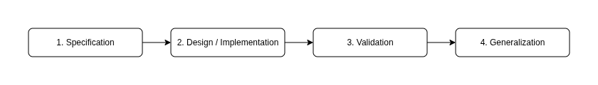
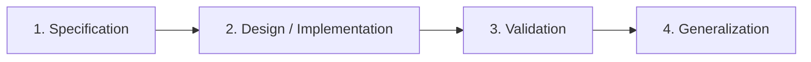

# Development Methodology

Engineers and developers may apply any preferred practices and conventions.
However the following should be considered.

## Complementary practices

The practices lean on the architecture's UML diagram and its layer boundaries
to guide day-to-day work.

### Continuous refactoring

The practice defines a process for the continuous evolution of the codebase.
The process is formalized by B. Meyer and is called *The cluster model of
software development*. In short, each unit, feature and application goes
through four mandatory steps:

   
mermaid

Generalization is the effort of transforming program elements into reusable
software components.

> NOTE: Even though the process is formalized, generalization is not
> completely mechanical. The decision to create a commonality should be driven
> by the broader context, including the application's evolution and business
> roadmap.

#### Practical aspects

With the UML diagram, developers have a blueprint of how the system should be
structured. But in practice there are several common pitfalls: premature
abstractions and the introduction of separate files per unit upfront.

Instead, implementation of a feature can start from one component/file with
inlined logic to keep it simple at first. Continuous refactoring then drives
the codebase to evolve naturally into a fully decomposed, structured form.

Any feature can be built quickly from scratch, or by copy/pasting bits and
units from other features, with later generalization of commonalities.

See also:

B. Meyer [The new culture of Software Development: Reflections on the Practice
of Object-Oriented
Design](https://www.researchgate.net/publication/242361456_The_new_culture_of_Software_Development_Reflections_on_the_Practice_of_Object-Oriented_Design)

### Outside-in development

The practice defines the directions of application development. At a high
level the development process is `outside-in`. The implementation starts from
a unit a user will interact with (`user interface`), then continues
through the entire application - through the layers and levels of abstraction.

The implementation of the `user interface` unit is made `top-down`: create a
single large layout, which covers the feature's requirements, then decompose
it into smaller reusable parts. An additional methodology can be applied here,
so the parts can be easily (from the layout perspective) reused and composed
back into something new (e.g. a new screen).

The implementation of inner units and abstractions (e.g. `presenter`,
`controller`, `entities`, `use case interactor`) is made `bottom-up`: create
common abstractions and units based on the existing declarations and
implementations.

#### Practical aspects

The practice defines the basic flow of a feature implementation:

1. User Interface (layout)
2. Presenter\<I\> and Controller\<I\>
3. Entities
4. Presenter
5. Controller
6. Use Case
7. Gateway\<I\>
8. External Resource
9. Gateway

Interfaces are not designed upfront - they are extracted from their consumers
as the flow reaches them. For example, the `user interface` defines
`presenter<I>` and `controller<I>` (step 2), the `use case` (step 6) defines
`gateway<I>` (step 7).  Each interface comes from an existing concrete need
rather than guessed in advance - so it fits exactly what the consumer uses,
nothing more.

The interfaces also enable parallel development. For example, the `user
interface` and the `external resource` units can be built at the same time.
One developer on the `user interface` with `presenter<I>` and `controller<I>`,
another on the `external resource` - neither needs anything from the other. A
third can focus on the core using the `presenter<I>` and `controller<I>`, and
a fourth bringing it all together by implementing the `gateway`.

Worth to mentions, that not every feature includes every step. A read-only
feature has no `controller` or `use case`, a single-operation feature may
invoke `gateway` directly. The flow lists the full sequence, every feature
uses the steps it needs.

See also:

Freeman, S., & Pryce, N. (2009). [Growing Object-Oriented Software, Guided by Tests. Addison-Wesley Professional](https://www.amazon.com/Growing-Object-Oriented-Software-Guided-Tests/dp/0321503627)

E. Bache [Outside-In Development with Double Loop TDD](https://coding-is-like-cooking.info/2013/04/outside-in-development-with-double-loop-tdd/)

React.dev [Thinking in React](https://react.dev/learn/thinking-in-react)

## Architecture-agnostic conventions

Clean Reactive Architecture stays neutral on the conventions below. Each note
simply shows how the architecture relates to the choice.

### Git branching model

Clean Reactive Architecture supports any git branching model. Features can be
delivered with long-lived feature branches (Git Flow) or granularly, unit by
unit (Trunk-based Development). The architecture gives insight on how work can
be split into chunks.

See also:

V. Driessen [A successful Git branching
model](https://nvie.com/posts/a-successful-git-branching-model)

[Trunk Based Development](https://trunkbaseddevelopment.com/)

A. Ruka
[OneFlow](https://www.endoflineblog.com/oneflow-a-git-branching-model-and-workflow)

Github.com [GitHub
flow](https://docs.github.com/en/get-started/using-github/github-flow)

### Folder structure

Clean Reactive Architecture supports any folder structure.

Files can be grouped by architectural layer (layered structure), where a
single feature is spread across every layer folder - all presenters together,
all use cases together, and so on.

Files can also be grouped by feature (vertical-sliced structure), where each
feature folder holds its own set of architectural units. A feature is a
self-contained, composable widget. Features in turn are composed into
route-driven pages.

Either works. Whichever is chosen, the units carry their role and
responsobility. It is a good idea to name the files holding them with explicit
suffixes (`UseCase`, `Presenter`, `Repository`, etc.), so each file's purpose
is clear regardless of where it sits.

See also:

S. Brown [Package by Component and Architecturally-aligned
Testing](https://dzone.com/articles/package-component-and)

M. Fowler [Presentation Domain Data
Layering](https://martinfowler.com/bliki/PresentationDomainDataLayering.html)
